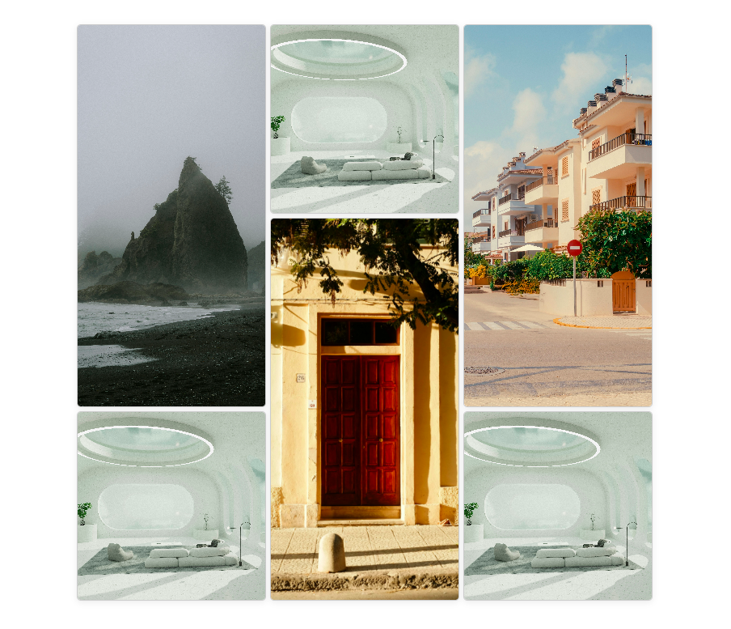

# Image-Grid-Layout
The primary focus of this project is to help me learn and practice the CSS Grid layout technique, which is essential for creating responsive and flexible web layouts. This project is also part of the solution to the challenge found here https://roadmap.sh/projects/image-grid

## Project Preview
